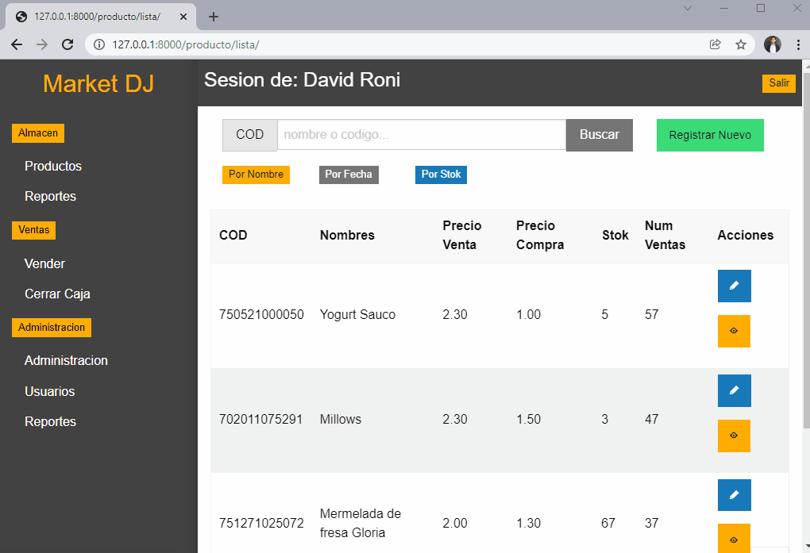
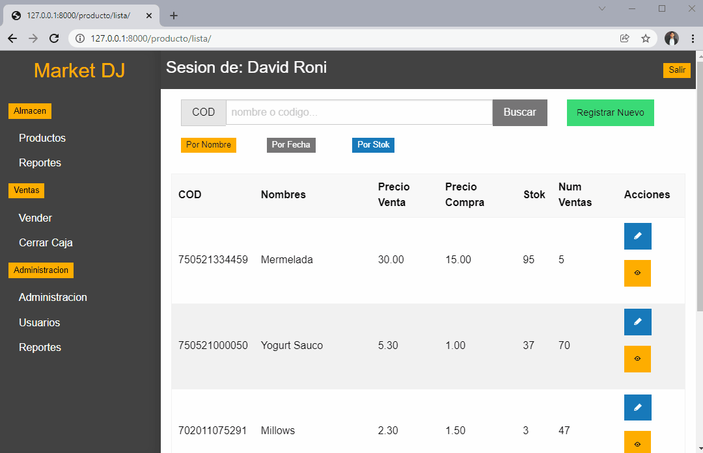
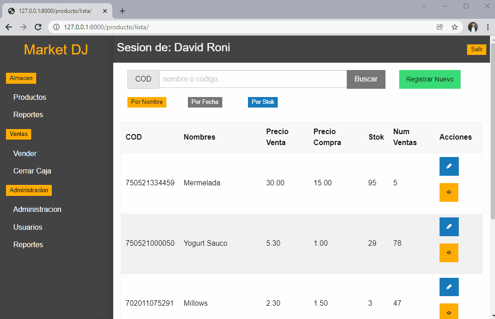

# **Punto de venta con Django**
#### **Proyecto desarrollado en el curso de UDEMY cuyo nombre es: Django y Django rest framework de básico a profesional de:Cristhian Santa Cruz Programador Full Stack**

A continuación adjunto el certificado que obtuve tras finalizar el grandioso curso de 41 horas de video.

## **Menu**

* [1) Descripccion del proyecto](#1-descripccion-del-proyecto)
    * [1.1) Breve visualizacion del proyecto](#11-breve-visualizacion-del-proyecto)
    * [1.2) Conocimientos puestos en practica](#12-conocimientos-puestos-en-practica)

* [2) Funcionamiento del proyecto](#2-funcionamiento-del-proyecto)
    * [2.1) Administracion de productos](#21-administracion-de-productos)
    * [2.2) Reportes de ventas de productos](#22-reportes-de-ventas-de-productos)

    * [2.3) Venta de productos](#23-venta-de-productos)
    * [2.4) Cierre de caja](#24-cierre-de-caja)
    * [2.5) Administracion de usuarios](#25-administracion-de-usuarios)
    * [2.6) Reportes para el administrador](#26-reportes-para-el-administrador)
    * [2.7) Restriccion de accesos](#26-reportes-para-el-administrador)

## **1) Descripccion del proyecto**

[Regresar al menu principal](#menu)

Antes de cualquier cosa es necesario partir con la siguiente pregunta ¿que es un punto de venta? a continuación adjunto algunas respuestas encontradas en internet:

* Un punto de venta (también conocido como sistema POS por sus siglas en inglés) es un programa informático creado para llevar el control de ventas e inventarios en un negocio, en conjunto con herramientas de hardware como monitores, escáneres de código de barras e impresoras, entre muchos otros

Una vez aclarado que es un punto procesedere a explicar que es lo que hace a grosso modo el  proyecto:

Este proyecto es un punto de venta, por lo tanto este proyecto permite registrar productos de venta, editarlos, eliminarlos y buscarlos.Este sistema tambien es capaz de generar reportes  de ventas en formato pdf en el cual vendran las ultimas ventas registradas de un producto en especifico. Ademas de lo anteriormente mencionado el sistema tambien es capaz de registrar las ventas que se le hagan a un cliente  y generar los importes de dichas ventas en formato pdf tal y como lo hace Oxxo cuando vamos a comprar algo, entre otras cosas mas el sistema tambien permite una  gestion de los usuarios que tendran acceso al sistema a los cuales se les podra restringir ciertos apartados del sistema.

### **1.1) Breve visualizacion del proyecto**

[Regresar al menu principal](#menu)

### **1.2) Conocimientos puestos en practica**

[Regresar al menu principal](#menu)

* Una buena organización de codigo en proyectos de Django
* El uso de diferentes vistas tales como: TemplateView,ListView,DetailView,UpdateView,DeleteView,View
* El uso de managers avanzados
* El uso de signals
* El uso de  formularios en Django
* La creación de diferentes Apps asi como tambien la creación de modelos.
* El uso de: **LoginRequiredMixin** para restringir el acceso a determinadas vistas si no cumplen con los permisos o el usuario no ha inciado sesion
* El uso de: **LoginRequiredMixin** para hacer permisos personalizados.
* El uso de sesiones y registros de usuarios.
* El uso de: PostgreSQL como sistema de gestión de bases de datos 
* El uso de: Foundation como framework de interfaz de usuario
* El constante uso del sitio de administración de Django

## **2) Funcionamiento del proyecto**

[Regresar al menu principal](#menu)

En los siguientes apartados se explicar **muy superficialmente** lo que puede hacer el sistema de ventas, y recalco que se explicara **muy superfialmento o mejor dicho se explicara lo mas trascendental** 

### **2.1) Administracion de productos**

[Regresar al menu principal](#menu)

Es posible buscar un producto por su nombre o codigo y ordenar los resultados  por stock o por fecha o por nombre, tambien es posible registrar nuevos productos, editar u eliminar los ya existentes, tambien es posible ver  las caracteristicas de estos, obtener un reporte de las ultimas ventas de un producto en particular y todo desde el apartado: **"Almacen/Productos"**, a continuación se muestra un ejemplo de como se hace lo anteriormente mencionado.

### **2.2) Reportes de ventas de productos**

[Regresar al menu principal](#menu)

En posible buscar a determinados productos a traves de mas de un filtro y posteriormente obtener un reporte en formato pdf de las ultimas ventas registradas de un producto en especifico

### **2.3) Venta de productos**

[Regresar al menu principal](#menu)

El apartado: **"Ventas/vender"** permite gestionar las ventas  de un cliente tal y como lo hace un Oxxo, y por si fuera poco este apartado tambien permite imprimir en formato de pdf los tickets de las ventas.

### **2.4) Cierre de caja**

[Regresar al menu principal](#menu)

En el apartado: **"Ventas/Cerrar Caja"** se podra apreciar el monto total de las ventas registradas en el dia actual, asi como el monto total de ventas canceladas y el numero de ventas realizadas en el dia actual, en este apartado tambien se podra cerrar la caja, y con ello ya no se podran cancelar las ventas realizadas antes de cerrar la caja ya que al cerrar la caja, se hace un cierre de cuentas y las ventas registradas en ese momento cambiar a estado de finalizadas

### **2.5) Administracion de usuarios**

[Regresar al menu principal](#menu)

En el apartado: **"Administracion/Usuarios"** se podran gestionar a los usuarios o mejor dicho a los trabajadores que acceden al sistema, de tal manera, es decir podra editarse su información, cambiar permisos de acceso o incluso eliminarlos o agregas mas usuarios

### **2.6) Reportes para el administrador**

[Regresar al menu principal](#menu)

En el apartado: **"Administracion/Reportes"** el administrador podra acceder y ver diferentes reportes, como las ventas del dia de hoy, las liquidaciones de los proveedores o ventas registradas en un cierto periodo de tiempo

### **2.7) Restriccion de accesos**

[Regresar al menu principal](#menu)

Es importante mencionar que:
*  Si un trabajador del area de VENTAS trata de entrar al apartado de ALMACEN o al area de ADMINISTRACION, el sistema no le permitira entrar.
*  Si un trabajador del area de ALMACEN trata de entrar al apartado de VENTAS o al area de ADMINISTRACION, el sistema no le permitira entrar
 entrar.
 * Solo los usuarios que esten registrados como ADMINISTRADORES podran entrar a cualquier area.
